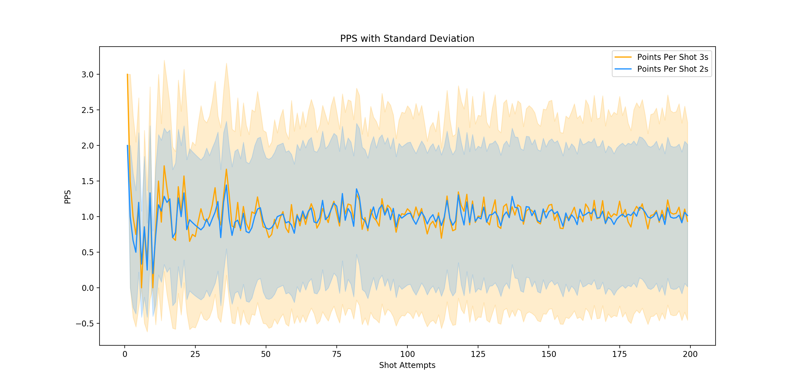
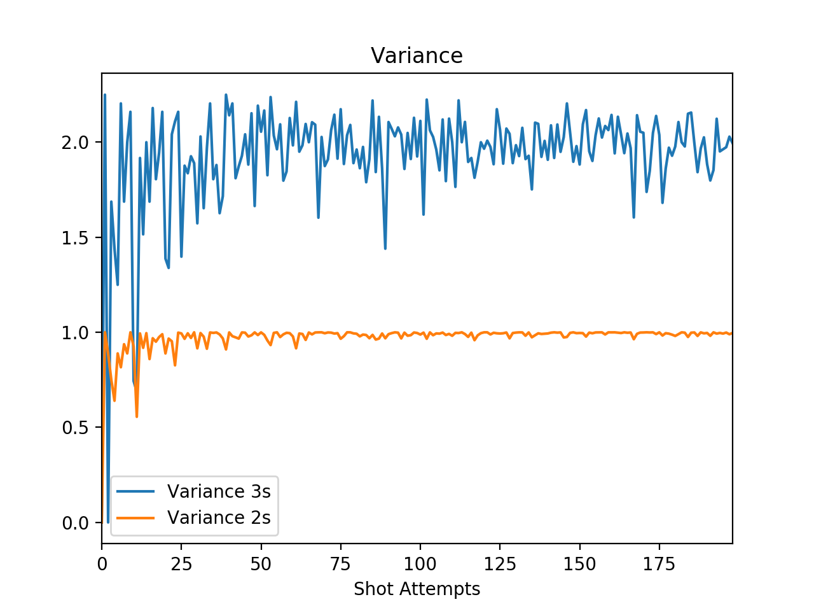
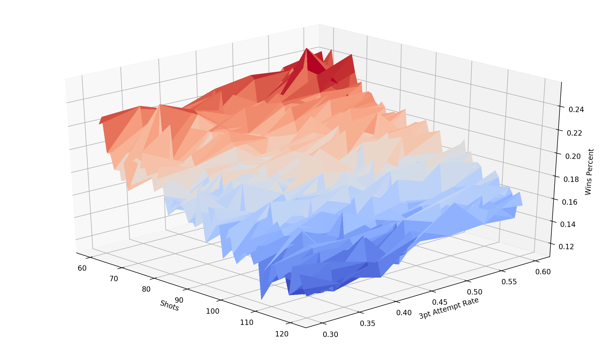
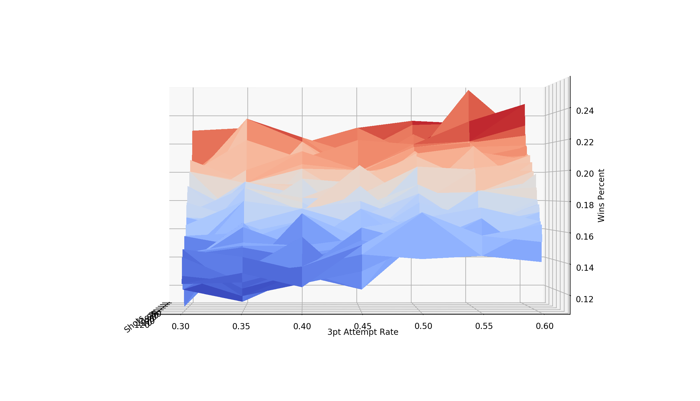
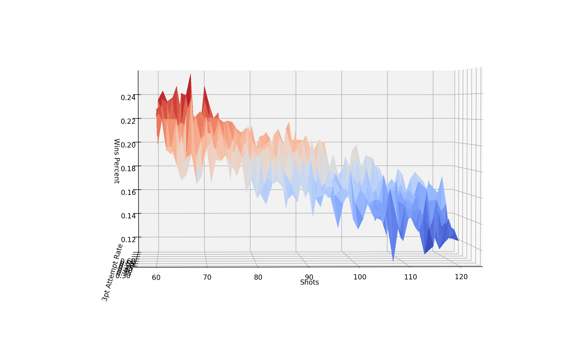

## Can you out sample the variance in an NBA game?

Normally I write tutorials here, but today I want to investigate a question I recently posted to twitter:
<blockquote class="twitter-tweet"><p lang="en" dir="ltr">If you had 2 teams:<br>Team 1: 80% 2 pt shots at 50% FG%, 20% 3pt shots at 33% FG%<br>Team 2: 50% 2 pt shots at 50% FG%, 50% 3pt shots at 33% FG%<br><br>And they played 1,000,000 times, all else being equal who do you think would win more games?</p>&mdash; Ryan Davis (@rd11490) <a href="https://twitter.com/rd11490/status/1198601947999285250?ref_src=twsrc%5Etfw">November 24, 2019</a></blockquote>

We are going to write a very simple simulation to explore this problem.
In the first simulation we are only going to care about shooting possessions. Turnovers, rebounds, fouls, etc are going to be ignored. This is basically a dice roll simulation extrapolated for basketball.

### [Basic Simulation](shot_profile_sim.py)

```python
import random
import pandas as pd
```
First up we are going to import pandas and random. Pandas is overkill
for what we are about to do, but could be useful if we decided to
expand on this question.
```python
shots = 90
ot_shots = 10

##########
# Team 1 #
##########
team1 = {
    '2pt rate': .80,
    '3pt rate': .20,
    '2pt%': .50,
    '3pt%': .33333
}

##########
# Team 2 #
##########
team2 = {
    '2pt rate': .50,
    '3pt rate': .50,
    '2pt%': .50,
    '3pt%': .33333
}
```
We are going to set the number of shots per game at 90 and if a game
ends in a tie, we will assume each team takes 90 shots
(League average is 88.9) and will get 10 shots per over time period
We also build out representations of our teams.


```python
def points(team):
    roll_shot_type = random.random()
    roll_make = random.random()

    if roll_shot_type <= team['2pt rate']:
        if roll_make <= team['2pt%']:
            return 2
    else:
        if roll_make <= team['3pt%']:
            return 3

    return 0
```
Now that all of the setup is done we can write a function to "simulate"
a shooting possession. We will first randomly select which type of shot the team
will take based on the attempt rates defined above. We will then "make" or "miss"
the shot randomly using the field goal percent we defined for the team.


```python
def play_game(shots_to_take):
    t1_points_in_game = 0
    t2_points_in_game = 0
    for shot in range(shots_to_take):
        t1_points_in_game += points(team1)
        t2_points_in_game += points(team2)
    return t1_points_in_game, t2_points_in_game
```
We will also define a function for simulating all shooting possession in a game.

```python
results = []

for game in range(1000000):
    t1_points, t2_points = play_game(shots)

    while t1_points == t2_points:
        t1_new, t2_new = play_game(10)
        t1_points += t1_new
        t2_points += t2_new

    result = {
        'team1': t1_points,
        'team2': t2_points,
        'game': game,
        'team1_win': t1_points > t2_points,
        'team2_win': t2_points > t1_points,
    }
    results.append(result)

```
We will run this simulation 1,000,000 times so that we get an adequate
sample of games. Because we don't want any games to end in a tie,
we will check the scores at the end of the "game" and as long as the
score is tied, we will keep playing ot periods until there is a winner.
Finally we will store all of our results into an object so that we better analyze them.
```python
frame = pd.DataFrame(results)

team1_wins = frame['team1_win'].sum() / frame.shape[0]
team2_wins = frame['team2_win'].sum() / frame.shape[0]

print('Team 1 wins {0:.2f}% of the time'.format(team1_wins * 100))
print('Team 2 wins {0:.2f}% of the time'.format(team2_wins * 100))
```
Store the results in a dataframe and calculate win percent

```
Team 1 wins 50.09% of the time
Team 2 wins 49.91% of the time
```

The above simulation is a very simple take on this problem. We are throwing out
90% of the game, but that isn't really the point I want to make with this simulation.

The point I want to drive home is that a single NBA game does not have
enough shots to overcome the higher variance of the three point shot.
Although both teams theoretically have an expected value of 1 PPS on all shots,
the team with the lower variance is going to win more often.


We can see the points per shot and variance as the sample of shots increases using the below [code](variance.py)
 :
```python
import pandas as pd
import numpy as np
import random

import matplotlib.pyplot as plt

pd.set_option('display.max_columns', 500)
pd.set_option('display.width', 1000)


fg3_pct = 0.33333
fg2_pct = 0.5

pps_results = []

def shots(n):
    shot_results_3 = []
    shot_results_2 = []

    result = { 'shots': n }
    for i in range(n):
        roll = random.random()
        if roll < fg3_pct:
            shot_results_3.append(3)
        else:
            shot_results_3.append(0)

        if roll < fg2_pct:
            shot_results_2.append(2)
        else:
            shot_results_2.append(0)


    result['Points Per Shot 3s'] = np.mean(shot_results_3)
    result['Variance 3s'] = np.var(shot_results_3)
    result['StDev 3s'] = np.std(shot_results_3)


    result['Points Per Shot 2s'] = np.mean(shot_results_2)
    result['Variance 2s'] = np.var(shot_results_2)
    result['StDev 2s'] = np.std(shot_results_2)

    return result

for n in range(1, 200):
    pps_results.append(shots(n))

df = pd.DataFrame(pps_results)

df[['Points Per Shot 3s', 'Points Per Shot 2s']].plot()
plt.title('PPS')
plt.xlabel('Shot Attempts')

df[['Variance 3s', 'Variance 2s']].plot()
plt.title('Variance')
plt.xlabel('Shot Attempts')

f3 = plt.figure()
plt.plot(df['shots'], df['Points Per Shot 3s'], color='orange', label='Points Per Shot 3s')
plt.fill_between(df['shots'], df['Points Per Shot 3s'] + df['StDev 3s'], df['Points Per Shot 3s'] - df['StDev 3s'], color='orange', alpha=0.2)

plt.plot(df['shots'], df['Points Per Shot 2s'], color='dodgerblue', label='Points Per Shot 2s')
plt.fill_between(df['shots'], df['Points Per Shot 2s'] + df['StDev 2s'], df['Points Per Shot 2s'] - df['StDev 2s'], color='dodgerblue', alpha=0.2)
plt.xlabel('Shot Attempts')
plt.ylabel('PPS')
plt.legend()
plt.title('PPS with Standard Deviation')

plt.show()

```





### [What about Offensive Rebounds?](shot_profile_with_orbd_sim.py)
A handful of people mentioned that the team taking more 3s will miss more shots,
leading to more offensive rebounding opportunities and thus giving them an advantage.
In order to account for this in our simulation we will assume both teams
have a league average offensive rebound rate (22.5%)
```python
##########
# Team 1 #
##########
team1 = {
    '2pt rate': .80,
    '3pt rate': .20,
    '2pt%': .50,
    '3pt%': .33333,
    'orbd': .225
}

##########
# Team 2 #
##########
team2 = {
    '2pt rate': .50,
    '3pt rate': .50,
    '2pt%': .50,
    '3pt%': .33333,
    'orbd': .225
}
```

We will edit our shooting possession code to account for offensive rebounds by
checking to see if the team recovered an offensive rebound, and then if they did, giving them another shot attempt:
```python
def points(team):
    roll_shot_type = random.random()
    roll_make = random.random()

    if roll_shot_type <= team['2pt rate']:
        if roll_make <= team['2pt%']:
            return 2
    else:
        if roll_make <= team['3pt%']:
            return 3

    roll_orbd = random.random()

    if roll_orbd < team['orbd']:
        return points(team)

    return 0
```

When both teams have a league average offensive rebound rate Team 2 is the team that
wins more often due to the extra shot attempts.
```python
Team 1 wins 46.79% of the time
Team 2 wins 53.21% of the time
```

### What About Turnovers?
Turnovers fall into that "All Things Being Equal" qualifier I provided.
We have no public methods for determining if a turnover was the result
of a team attempting to generate a 2pt shot or a 3pt shot so we can't use
shot profile to adjust. Because of this our simulation would have both teams
turning over the ball at the same rate with the same variance, giving it no impact on what we are trying to simulate.

### Is High Variance the Key to Winning with an Out Matched Team?
Often during the Warriors Dynasty, I would hear NBA media people suggest that the
best way to beat the Warriors was to play their way and hope you got lucky.
People would suggest that you need to play fast, shoot a ton of 3s and hope
that they miss a bunch of shots and you make a bunch of shots.

In this section we are going to try to simulate this situation.
In order to test this we are going to make 3 very big assumptions:

1. Team 1 is 5 percentage points better than Team 2 in all aspects of the game
2. Team 1 has a perfectly event shot distribution, 50% 2s, 50% 3s.
2. Turnovers, Fouls, FreeThrows, etc are ignored. We will only account for shots and offensive rebounds

We will vary the lesser teams 3 point attempt rate, and the pace of the game
and measure the underdog's win percentage.


The code for this simulation is almost exactly the same was the code for the previous simulation, but we will make a few changes:

```python
import random

import pandas as pd
from mpl_toolkits.mplot3d import Axes3D
from matplotlib import cm
import matplotlib.pyplot as plt
```
We need to include matplotlib for plotting purposes.


```python
pd.set_option('display.max_columns', 500)
pd.set_option('display.width', 1000)

num_games = 1000
ot_shots = 10

##########################
# Team 1 - Stronger Team #
##########################
team1 = {
    '2pt rate': .50,
    '3pt rate': .50,
    '2pt%': .55,
    '3pt%': .38,
    'orbd': .275
}

#############################
# Team 2 - Out Matched Team #
############################
team2 = {
    '2pt rate': .50,
    '3pt rate': .50,
    '2pt%': .50,
    '3pt%': .33,
    'orbd': .225
}
```
We want to make sure that Team 1 is 5 percentage points better from 2, 3 and in offensive rebounds.
This is an arbitrary number.

```python
def points(team):
    roll_shot_type = random.random()
    roll_make = random.random()

    if roll_shot_type <= team['2pt rate']:
        if roll_make <= team['2pt%']:
            return 2
    else:
        if roll_make <= team['3pt%']:
            return 3

    roll_orbd = random.random()

    if roll_orbd < team['orbd']:
        return points(team)

    return 0


def play_game(shots_to_take):
    t1_points_in_game = 0
    t2_points_in_game = 0
    for shot in range(shots_to_take):
        t1_points_in_game += points(team1)
        t2_points_in_game += points(team2)
    return t1_points_in_game, t2_points_in_game
```
Our code to simulate shooting possessions and game is exactly the same as in the previous sims.

```python
results = []
for rate3 in [0.3, 0.35, 0.4, 0.45, 0.5, 0.55, 0.6]:
    team2['3pt rate'] = rate3
    team2['2pt rate'] = 1 - rate3
    for shots in range(60, 121):
        for game in range(num_games):
            t1_points, t2_points = play_game(shots)

            while t1_points == t2_points:
                t1_new, t2_new = play_game(ot_shots)
                t1_points += t1_new
                t2_points += t2_new

            result = {
                'shots': shots,
                '3rate': rate3,
                'team1': t1_points,
                'team2': t2_points,
                'game': game,
                'team2_win': t2_points > t1_points,
            }
            results.append(result)
```
We are going to vary our 3pt attempt rate from 30% of the underdog's shots form 3 to 60% of their shots from 3.
We are also going to vary the pace of the game from a game where the pace was grounded to a halt and each team only had 60 shots
to a high flying game where each team took 120 shots.


```python
frame = pd.DataFrame(results)
wins = frame.groupby(by=['shots', '3rate'])['team2_win'].sum().reset_index()
wins['win%'] = wins['team2_win']/num_games

fig = plt.figure()
ax = Axes3D(fig) #<-- Note the difference from your original code...
# Data for three-dimensional scattered points

zdata = wins['win%']
xdata = wins['shots']
ydata = wins['3rate']
ax.plot_trisurf(xdata, ydata, zdata, cmap=cm.coolwarm, linewidth=0, antialiased=False)
ax.set_xlabel('Shots')
ax.set_ylabel('3pt Attempt Rate')
ax.set_zlabel('Wins Percent')

plt.show()
```
We store our results in a dataframe, group by the our two independent variables and measure the win percentage for our underdog
We then plot the results on a 3d plot. From the result of our plot we can see that in our simplified scenario our optimal strategy
is to slow the pace of the game as much as possible and shoot as many 3s as we can. Because there is a defined skill gap, the underdog needs
to use variance to their advantage, and in this case that means taking as many high variance shots as possible, while limiting
the sample size as much as possible as well. If you played this out thousands of times, you might lose the games you loose by more points
than if you played a different play style, but your odds of winning go up. In the standigns it doesn't matter if you lose by 1 or by 100, so
the high variance strategy should be prefered.






